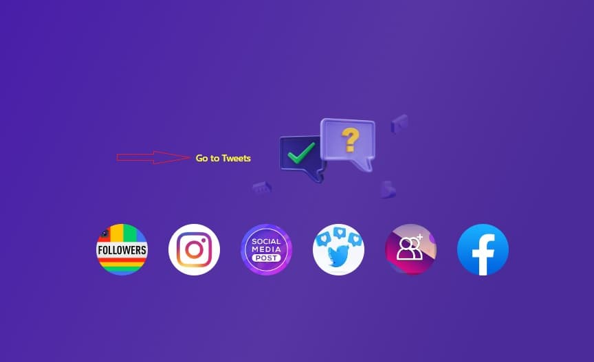
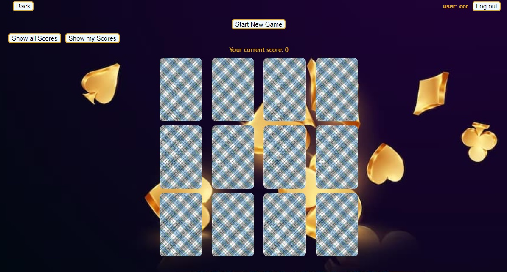
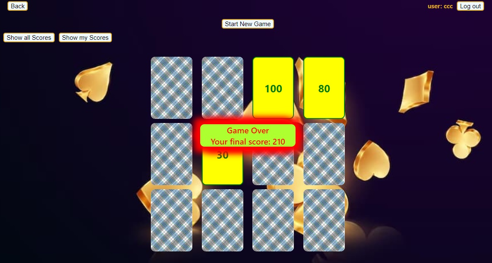
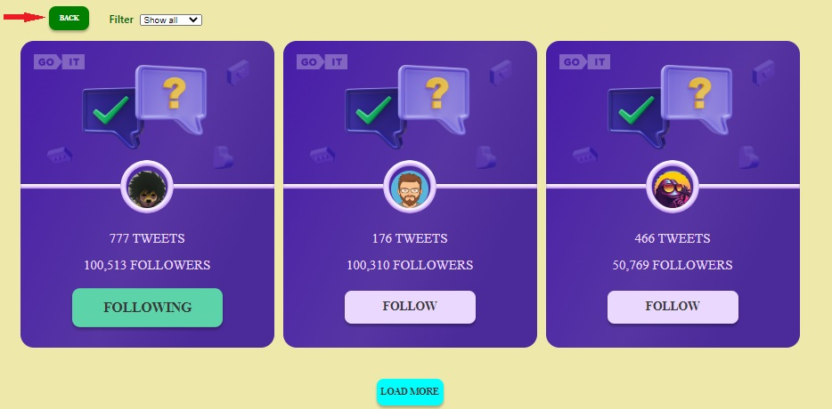
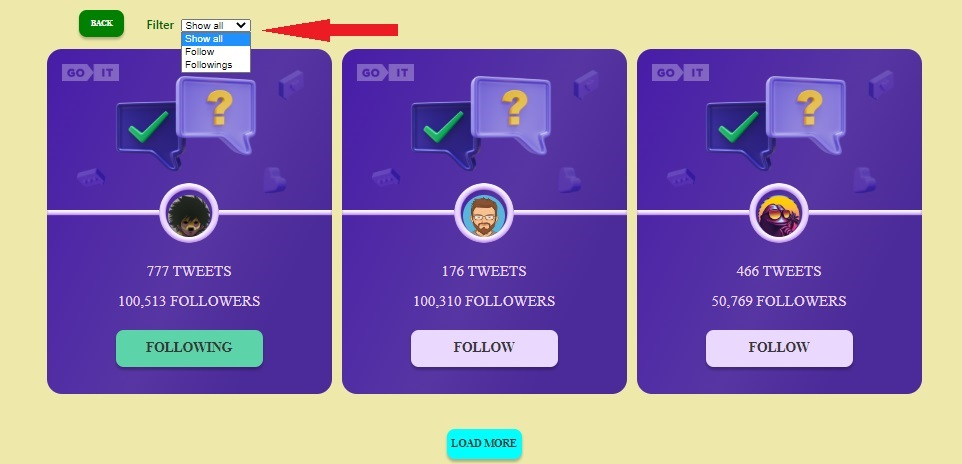
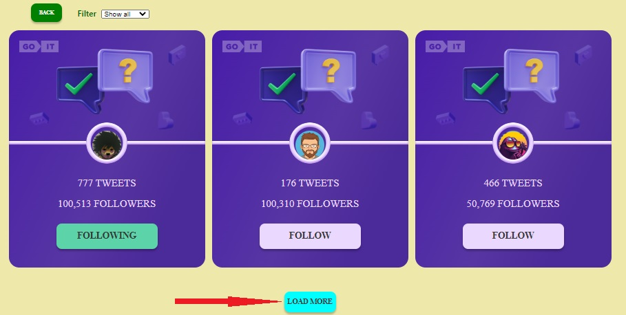

# **_Cards_**

This application is made with  
[Create React App](https://github.com/facebook/create-react-app).

---

## **_Description application_**

App link - [e-gap.github.io/cards/](e-gap.github.io/cards/)

App is as a simple game, where user can choose cards and score points. After
Sign In user can save his score avtomatically after each game. He can view score
history every user ant his own history as well. User can sort score history by
date and by user as well.

App consists of two pages: [Home](https://e-gap.github.io/cards/) and
[Cards](https://e-gap.github.io/cards/cards).

On the page [Home](https://e-gap.github.io/cards/) we can see general decoration
of Home page with animation. Also on Home page is button `«Go to Cards»` that we
can click on and go to the page [Cards](https://e-gap.github.io/cards/cards).

Page [Cards](https://e-gap.github.io/cards/cards) looks like this:

On this page user can play the game. User chooses a card and click on it. After
this user's action card turns and user can see score. This score adds to current
user's score. After choosing three cards the game is over and user can see his
final score a few seconds. After few seconds final score disappears and
automatically is being saved saved to the score history (if user Signed In).

After click on button `«Start New Game»`
[Start New Game](./assets/start-new-game.jpg) user can start new game.

Якщо ми стаєм підписником користувача, то в його картці збільшується кількість
підписників на 1. Якщо відписуємся від користувача - то в його картці
зменшується кількість підписників на 1.

Також на сторінці [Tweets](https://e-gap.github.io/tweets-pr/tweets) у лівому
верхньому куті є кнопка `«BACK»`, 
натиснувши на яку, ми переходимо на сторінку
[Home](https://e-gap.github.io/tweets-pr/).

На сторінці [Tweets](https://e-gap.github.io/tweets-pr/tweets) ми можемо
управляти виведенням на екран користувачів однієї з доступних нам категорій:
`«Shaw all»` (користувачі усіх категорій) `«Follow»` (користувачі, підписниками
яких ми не є) `«Followings»` (користувачі, підписниками яких ми є) за допомогою
фільтра:  Після обрання у фільтрі
потрібної категорії - на сторніці з'являться тыльки картки користувачів обраної
категорії.

По замовчуванню на сторінці [Tweets](https://e-gap.github.io/tweets-pr/tweets)
відображається до трьох карток користувачів однієї категорії. Якщо в базі даних
користувачів обраної категорії більше, ніж ми бачимо на екрані, ми можемо
натиснути кнопку `«LOAD MORE»`
 і тоді на екрані до вже
видимих на екрані користувачів додадуться ще слідуючі (три, а бо менше). Якщо в
базі даних кількість користувачів дорівнює кількості, яку ми вже бачимо на
екрані, тоді кнопка `«LOAD MORE»` перестає відображатися на екрані.

Якщо у нас сталася помилка і нам не доступні користувачі із бази даних, тоді на
екрані з'явиться текст помилки: 

Якщо кількість користувачів обраної категорії в базі даних дорівнює 0Ю то на
екрані з'явиться текст повідомлення: 

---

## **_Використані бібліотеки для створення застосунку_**

[axios](https://axios-http.com/)
[prop-types](https://github.com/facebook/prop-types)
[react-router-dom](https://github.com/remix-run/react-router)
